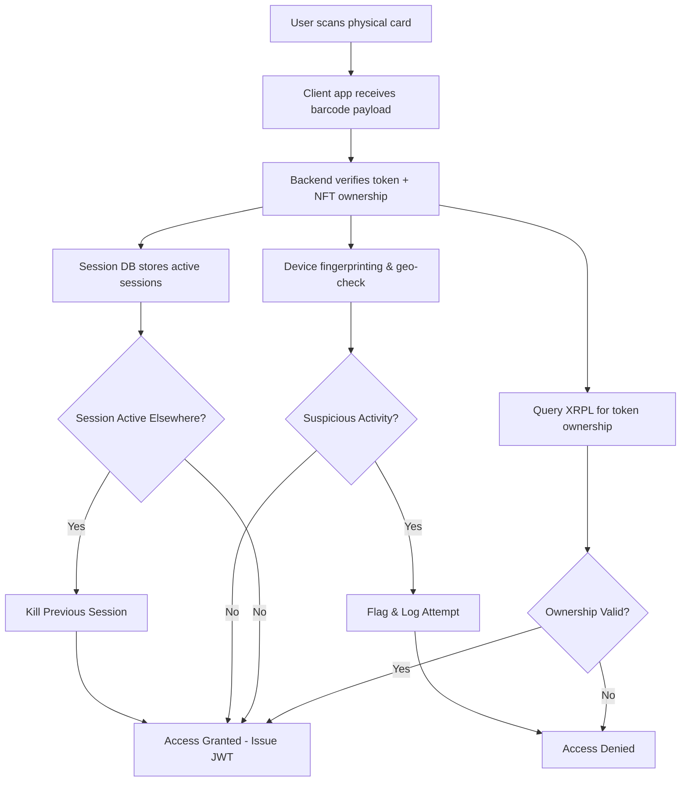

# Top Dog Arena - NFT-Backed Card Authentication Guide

## 🎯 Overview
This document outlines the complete authentication strategy for Top Dog Arena, combining physical collectible cards with NFT ownership verification. The system prevents unauthorized sharing through session binding, liveness checks, and device tracking while maintaining seamless user experience.

## 🏗️ Architecture Components

### High-Level Flow


## 🔐 Barcode Payload Design

### Standard Payload Format
```json
{
  "token_id": "12345ABCDE",
  "nft_contract": "xrpl:nft:topdogarena",
  "collection": "big-dog-champions",
  "nonce": "550e8400-e29b-41d4-a716-446655440000",
  "exp": "2025-12-31T23:59:59Z",
  "access_tier": "premium",
  "signature": "encrypted_signature_hash"
}
```

### Payload Fields Explanation
- **token_id**: Unique NFT identifier on XRPL
- **nft_contract**: Contract/issuer address on XRPL
- **collection**: Collection name for access tier mapping
- **nonce**: UUID v4 to prevent replay attacks
- **exp**: Expiration timestamp for time-limited access
- **access_tier**: Role-based access level (basic, premium, vip, legend)
- **signature**: Encrypted hash for payload verification

### Anti-Copy Microtrace Integration
```json
{
  "microtrace_id": "MT_ABC123XYZ",
  "verification_url": "https://verify.microtrace.com/api/v1/validate",
  "encrypted_payload": "base64_encoded_encrypted_data",
  "local_key": "offline_verification_key"
}
```

## 🛡️ Security Layers

### 1. Session Binding & Management
```typescript
interface ActiveSession {
  sessionId: string;
  tokenId: string;
  walletAddress: string;
  deviceFingerprint: string;
  ipAddress: string;
  geoLocation: {
    country: string;
    city: string;
    coords?: { lat: number; lng: number; }
  };
  createdAt: Date;
  lastActivity: Date;
  expiresAt: Date;
  isActive: boolean;
}
```

### 2. Anti-Sharing Tactics
- **Session Binding**: Tie each scan to live session token (JWT)
- **Device Fingerprinting**: Log browser/device metadata on scan
- **Geo/IP Monitoring**: Track location at scan time
- **Session Expiry**: 15-30 minute auto-expiry with re-auth required
- **One-Time Tokens**: Mark nonce as "used" after successful scan
- **Concurrent Session Limits**: Max 1 active session per token/wallet

### 3. Liveness Detection (Optional)
- **WebRTC Face Mesh**: Prevent photo/print abuse
- **Biometric Binding**: Fingerprint or face liveness for high-value access
- **Movement Detection**: Require subtle head movement during scan

## 🔧 Implementation Components

### Backend Service Structure
```
/auth-service/
├── src/
│   ├── handlers/
│   │   ├── verify-scan.go          # Main verification endpoint
│   │   ├── session-manager.go      # Session CRUD operations
│   │   └── liveness-check.go       # Biometric verification
│   ├── services/
│   │   ├── nft-verifier.go         # XRPL ownership verification
│   │   ├── barcode-parser.go       # QR/barcode payload parsing
│   │   ├── anti-replay.go          # Nonce tracking & validation
│   │   └── device-fingerprint.go   # Device/browser profiling
│   ├── middleware/
│   │   ├── rate-limiter.go         # Request rate limiting
│   │   ├── geo-check.go            # IP geolocation validation
│   │   └── session-enforcer.go     # Concurrent session management
│   ├── models/
│   │   ├── session.go              # Session data structure
│   │   ├── nft.go                  # NFT metadata structure
│   │   └── auth-attempt.go         # Security logging
│   └── utils/
│       ├── xrpl-client.go          # XRPL blockchain queries
│       ├── encryption.go           # Payload encryption/decryption
│       └── jwt-manager.go          # JWT token generation
├── configs/
│   ├── auth-config.yaml            # Authentication settings
│   └── xrpl-config.yaml            # XRPL network configuration
└── migrations/
    ├── 001_create_sessions.up.sql
    ├── 002_create_nonces.up.sql
    └── 003_create_auth_logs.up.sql
```

### Database Schema

#### Sessions Table
```sql
CREATE TABLE active_sessions (
    id UUID PRIMARY KEY DEFAULT gen_random_uuid(),
    session_id VARCHAR(255) UNIQUE NOT NULL,
    token_id VARCHAR(255) NOT NULL,
    wallet_address VARCHAR(255) NOT NULL,
    device_fingerprint TEXT NOT NULL,
    ip_address INET NOT NULL,
    geo_country VARCHAR(2),
    geo_city VARCHAR(100),
    geo_coords POINT,
    created_at TIMESTAMP WITH TIME ZONE DEFAULT NOW(),
    last_activity TIMESTAMP WITH TIME ZONE DEFAULT NOW(),
    expires_at TIMESTAMP WITH TIME ZONE NOT NULL,
    is_active BOOLEAN DEFAULT true,
    INDEX idx_token_active (token_id, is_active),
    INDEX idx_wallet_active (wallet_address, is_active),
    INDEX idx_expires_at (expires_at)
);
```

#### Nonce Tracking Table
```sql
CREATE TABLE used_nonces (
    id UUID PRIMARY KEY DEFAULT gen_random_uuid(),
    nonce VARCHAR(255) UNIQUE NOT NULL,
    token_id VARCHAR(255) NOT NULL,
    used_at TIMESTAMP WITH TIME ZONE DEFAULT NOW(),
    ip_address INET NOT NULL,
    INDEX idx_nonce (nonce),
    INDEX idx_token_used (token_id, used_at)
);
```

#### Authentication Logs Table
```sql
CREATE TABLE auth_attempts (
    id UUID PRIMARY KEY DEFAULT gen_random_uuid(),
    token_id VARCHAR(255),
    wallet_address VARCHAR(255),
    attempt_type VARCHAR(50) NOT NULL, -- 'scan', 'verify', 'reject'
    success BOOLEAN NOT NULL,
    failure_reason VARCHAR(255),
    ip_address INET NOT NULL,
    user_agent TEXT,
    device_fingerprint TEXT,
    geo_location JSONB,
    created_at TIMESTAMP WITH TIME ZONE DEFAULT NOW(),
    INDEX idx_token_attempts (token_id, created_at),
    INDEX idx_ip_attempts (ip_address, created_at)
);
```

## 🚀 API Endpoints

### 1. Verify Scan Endpoint
```http
POST /auth/verify-scan
Content-Type: application/json

{
  "barcode_payload": "base64_encoded_qr_data",
  "device_info": {
    "fingerprint": "browser_device_hash",
    "user_agent": "Mozilla/5.0...",
    "screen_resolution": "1920x1080",
    "timezone": "America/New_York"
  },
  "client_ip": "192.168.1.100",
  "liveness_proof": {
    "type": "face_mesh",
    "confidence": 0.95,
    "timestamp": "2025-07-19T12:00:00Z"
  }
}
```

**Response (Success):**
```json
{
  "success": true,
  "access_token": "eyJhbGciOiJIUzI1NiIsInR5cCI6IkpXVCJ9...",
  "refresh_token": "eyJhbGciOiJIUzI1NiIsInR5cCI6IkpXVCJ9...",
  "session_id": "550e8400-e29b-41d4-a716-446655440000",
  "expires_at": "2025-07-19T12:30:00Z",
  "access_tier": "premium",
  "nft_metadata": {
    "token_id": "12345ABCDE",
    "collection": "big-dog-champions",
    "rarity": "legendary",
    "traits": {
      "power": 95,
      "defense": 88,
      "special_ability": "meme_mastery"
    }
  }
}
```

### 2. Session Refresh Endpoint
```http
POST /auth/refresh-session
Authorization: Bearer {refresh_token}
```

### 3. Session Termination
```http
DELETE /auth/sessions/{session_id}
Authorization: Bearer {access_token}
```

### 4. Device Management
```http
GET /auth/active-devices
Authorization: Bearer {access_token}

DELETE /auth/devices/{device_fingerprint}
Authorization: Bearer {access_token}
```

## 🔍 XRPL Integration

### NFT Ownership Verification
```go
func verifyNFTOwnership(tokenID string, expectedOwner string) (*NFTDetails, error) {
    // Query XRPL for current NFT owner
    nftObject, err := xrplClient.GetNFTObject(tokenID)
    if err != nil {
        return nil, fmt.Errorf("failed to query NFT: %v", err)
    }
    
    // Verify ownership
    if nftObject.Owner != expectedOwner {
        return nil, fmt.Errorf("NFT not owned by expected address")
    }
    
    // Extract metadata
    metadata, err := parseNFTMetadata(nftObject.URI)
    if err != nil {
        return nil, fmt.Errorf("failed to parse metadata: %v", err)
    }
    
    return &NFTDetails{
        TokenID:    tokenID,
        Owner:      nftObject.Owner,
        Collection: metadata.Collection,
        Rarity:     metadata.Rarity,
        Traits:     metadata.Traits,
    }, nil
}
```

### Access Tier Mapping
```go
func determineAccessTier(nft *NFTDetails) string {
    switch {
    case nft.Rarity == "legendary" || nft.Collection == "big-dog-founders":
        return "legend"
    case nft.Rarity == "epic" || nft.Traits["power"] > 90:
        return "vip"
    case nft.Rarity == "rare":
        return "premium"
    default:
        return "basic"
    }
}
```

## 🛠️ Frontend Integration

### QR Code Scanner Component
```typescript
@Component({
  selector: 'app-nft-card-scanner',
  template: `
    <div class="scanner-container">
      <qr-scanner 
        #scanner
        (scanSuccess)="onScanSuccess($event)"
        (scanError)="onScanError($event)">
      </qr-scanner>
      
      <div class="liveness-check" *ngIf="requireLiveness">
        <face-mesh-detector
          (faceDetected)="onFaceDetected($event)">
        </face-mesh-detector>
      </div>
    </div>
  `
})
export class NftCardScannerComponent {
  
  async onScanSuccess(qrData: string) {
    try {
      // Parse QR payload
      const payload = this.parseQRPayload(qrData);
      
      // Collect device fingerprint
      const deviceInfo = await this.getDeviceFingerprint();
      
      // Get liveness proof if required
      const livenessProof = this.requireLiveness ? 
        await this.getLivenessProof() : null;
      
      // Submit verification request
      const authResult = await this.authService.verifyCardScan({
        barcode_payload: btoa(qrData),
        device_info: deviceInfo,
        liveness_proof: livenessProof
      });
      
      if (authResult.success) {
        this.handleAuthSuccess(authResult);
      } else {
        this.handleAuthFailure(authResult.error);
      }
      
    } catch (error) {
      this.handleScanError(error);
    }
  }
}
```

## 📊 Monitoring & Analytics

### Security Metrics Dashboard
- **Failed Authentication Attempts**: Track by IP, token, time
- **Geographic Anomalies**: Multiple locations for same token
- **Device Switching**: Frequent device changes per wallet
- **Session Duration**: Average and outlier session lengths
- **Nonce Replay Attempts**: Blocked duplicate nonce usage

### Alert Thresholds
- **5+ failed attempts** from same IP in 10 minutes
- **3+ different geolocations** for same token in 1 hour
- **10+ concurrent session attempts** for same wallet
- **Expired token usage** attempts

## 🚦 Development Phases

### Phase 1: Core Authentication (Weeks 1-2)
- [x] QR payload parsing and validation
- [x] XRPL ownership verification
- [x] Basic session management
- [x] JWT token generation
- [x] Nonce replay prevention

### Phase 2: Security Hardening (Weeks 3-4)
- [ ] Device fingerprinting implementation
- [ ] Geographic IP validation
- [ ] Concurrent session limiting
- [ ] Rate limiting and DDoS protection
- [ ] Security logging and monitoring

### Phase 3: Advanced Features (Weeks 5-6)
- [ ] Liveness detection integration
- [ ] Biometric binding (optional)
- [ ] Offline verification mode
- [ ] Microtrace anti-copy integration
- [ ] Analytics dashboard

### Phase 4: Mobile & Hardware (Weeks 7-8)
- [ ] Mobile app QR scanner
- [ ] Hardware wallet integration
- [ ] NFC card support (future)
- [ ] Wearable device auth (future)

## 🔧 Configuration Examples

### Authentication Service Config
```yaml
auth:
  jwt:
    secret: "${JWT_SECRET}"
    access_token_ttl: "30m"
    refresh_token_ttl: "7d"
  
  sessions:
    max_concurrent: 1
    inactivity_timeout: "30m"
    cleanup_interval: "5m"
  
  security:
    max_attempts_per_ip: 10
    rate_limit_window: "10m"
    geo_check_enabled: true
    device_fingerprint_required: true
  
  xrpl:
    network: "mainnet"
    api_url: "https://s1.ripple.com:51234"
    fallback_urls:
      - "https://s2.ripple.com:51234"
      - "https://xrplcluster.com"
```

### Frontend Environment Config
```typescript
export const environment = {
  production: true,
  auth: {
    apiUrl: 'https://api.topdogarena.com/auth',
    requireLiveness: false,
    maxRetries: 3,
    scanTimeout: 30000
  },
  features: {
    biometricAuth: false,
    offlineMode: false,
    nfcSupport: false
  }
};
```

## 🧪 Testing Strategy

### Unit Tests
- QR payload parsing edge cases
- NFT ownership verification mocks
- Session management lifecycle
- JWT token validation
- Device fingerprint generation

### Integration Tests
- Complete scan-to-auth flow
- XRPL blockchain queries
- Database session management
- Rate limiting enforcement
- Geographic validation

### Security Tests
- Replay attack prevention
- Session hijacking attempts
- Concurrent login blocking
- IP spoofing detection
- Nonce collision handling

### Performance Tests
- High-volume scan processing
- Database query optimization
- XRPL API response times
- Memory usage under load
- Session cleanup efficiency

## 📚 Implementation Copilot Prompts

### Backend Service Prompts

1. **Create Scan Verification Endpoint**
```
Create a Go HTTP handler for /verify-scan that:
- Accepts JSON payload with barcode data and device info
- Parses and validates QR code payload structure
- Checks nonce hasn't been used before (anti-replay)
- Queries XRPL to verify NFT ownership
- Creates new session if valid, kills old sessions for same token
- Returns JWT access token with NFT metadata
- Logs all attempts for security monitoring
```

2. **Session Management Service**
```
Build a Go session manager that:
- Stores active sessions in PostgreSQL with device fingerprints
- Enforces max 1 concurrent session per token/wallet
- Auto-expires sessions after 30min inactivity
- Provides cleanup job to remove expired sessions
- Supports session refresh and explicit logout
- Tracks geographic anomalies (same token, different countries)
```

3. **XRPL Integration Service**
```
Create an XRPL client wrapper that:
- Queries NFT objects by token ID
- Verifies current ownership against expected wallet
- Fetches and parses NFT metadata from IPFS/URI
- Handles network failures with retry logic
- Maps NFT traits to access tier levels
- Caches results for performance (5min TTL)
```

### Frontend Component Prompts

4. **QR Scanner Component**
```
Build an Angular component for NFT card scanning that:
- Uses @zxing/ngx-scanner for QR code detection
- Collects device fingerprint (screen, timezone, user agent)
- Handles scan success/failure states with user feedback
- Calls auth service verify-scan endpoint
- Stores JWT tokens in secure storage
- Redirects to authenticated area on success
```

5. **Liveness Detection Component**
```
Create a face liveness detector that:
- Uses MediaPipe Face Mesh for real face detection
- Requires subtle head movement (not just static photo)
- Calculates confidence score (>0.9 required)
- Works in various lighting conditions
- Provides user guidance ("turn head slightly left")
- Times out after 30 seconds if no valid detection
```

### Security & Monitoring Prompts

6. **Device Fingerprinting Service**
```
Implement browser fingerprinting that collects:
- Screen resolution and color depth
- Timezone and language settings
- Canvas fingerprint hash
- WebGL renderer info
- Available fonts list
- Hardware concurrency (CPU cores)
- Generates stable hash, stores for session binding
- Detects significant fingerprint changes
```

7. **Security Monitoring Dashboard**
```
Build an admin dashboard showing:
- Real-time authentication attempts (success/fail)
- Geographic heatmap of scan locations
- Alert feed for suspicious activities
- Session analytics (duration, concurrent peaks)
- NFT usage statistics (most scanned tokens)
- Rate limiting and blocked IP lists
```

## 🎯 Success Metrics

### Security KPIs
- **0 successful replay attacks** detected
- **<1% false positive** authentication rejections
- **<5 second average** scan-to-auth completion time
- **99.9% uptime** for authentication service
- **<0.1% account takeover** incidents

### User Experience KPIs
- **<3 second** QR scan recognition time
- **>95% first-scan success** rate
- **<2 support tickets per 1000 scans**
- **>90% user satisfaction** with auth flow

### Business KPIs
- **100% NFT ownership verification** accuracy
- **Tiered access adoption** by rarity level
- **Session engagement** duration by access tier
- **Anti-sharing effectiveness** (session conflicts blocked)

---

## 📞 Support & Maintenance

### Runbooks
- **Authentication Service Restart**: Step-by-step recovery procedure
- **XRPL Network Issues**: Failover to backup nodes
- **Database Migration**: Schema update procedures
- **Security Incident Response**: Breach containment steps

### Regular Maintenance
- **Weekly**: Review security logs and anomalies
- **Monthly**: Update XRPL node configurations
- **Quarterly**: Security penetration testing
- **Annually**: Cryptographic key rotation

---

*This authentication guide serves as the complete reference for implementing secure, NFT-backed card authentication in Top Dog Arena. Update this document as new requirements or security considerations emerge.*

**Last Updated**: July 19, 2025  
**Version**: 1.0  
**Next Review**: August 19, 2025
